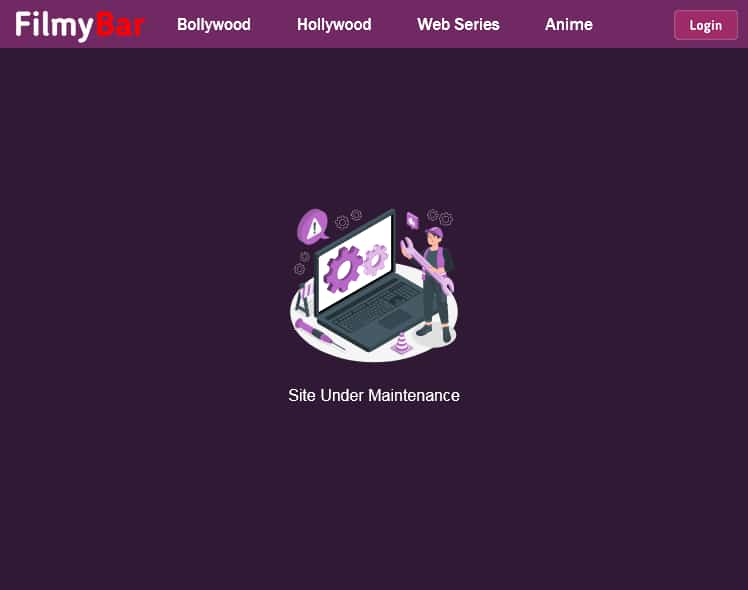

  
   
  
   

  
  
  

<h2>FilmyBar - Movie Website</h2>
A front-end design for a movie website page. 
<a href="https://imshivlok.github.io/filmybar/"><strong>➥View Demo</strong></a>

<h2>Demo Screenshots</h2>
  
  

<h2>Active Hosts</h2>
1. https://imshivlok.github.io/filmybar/ (stable) 
2. https://filmybar--imshivlok.repl.co (beta)

<h2>Dormant Hosts</h2>
1. https://filmybar2023.blogspot.com/ 
2. https://filmybar-ie.blogspot.com/ (ie) 
3. https://filmybar.tiiny.site/ 
4. https://filmybar-ie.tiiny.site/ (ie) 
5. https://filmybar-beta.tiiny.site (unstable-beta)

<h2>Contact</h2>
If you want to contact with me you can reach me at <a href="https://www.instagram.com/imshivlok" target="_blank">Instagram</a>.

<h2>License</h2>
This project is <strong>free to use</strong> and does not contains any license.  

|DISCLAIMER: I do not intend to host any pirated content on this site. This site is purely meant to demonstrate my creative skills.|
|---|
